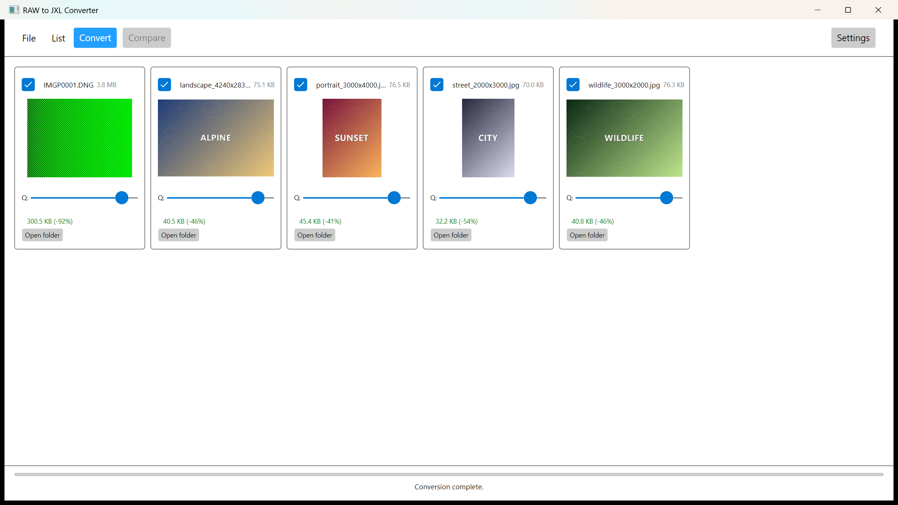
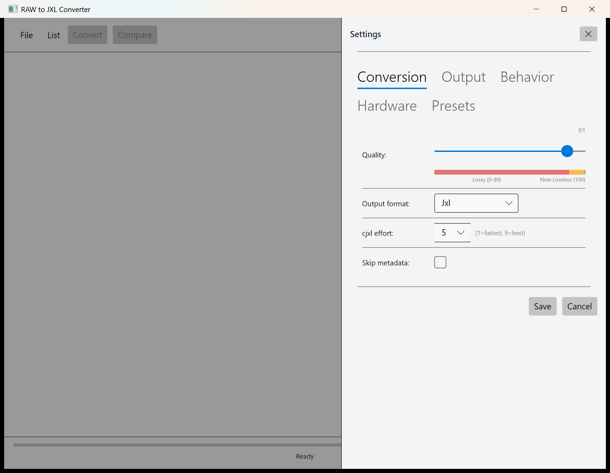
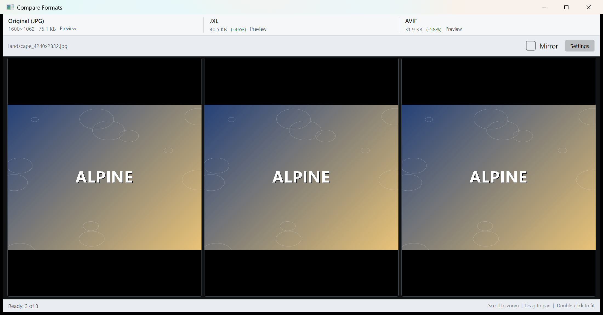

# RAWtoJXL

Convert RAW camera files to JPEG-XL, JPEG, or AVIF — with a fast, modern desktop UI. Also converts between the raster formats: JPEG, JPEG-XL and AVIF.

Built on .NET 8 and Avalonia. Uses rawspeed-cli for high-fidelity RAW rendering (with a Magick.NET fallback), Magick.NET for image conversion, `cjxl` for JPEG-XL encoding, `djxl` for JPEG-XL decoding, and `exiftool` for metadata preservation.

## Why JPEG-XL?

JPEG-XL is a next-generation image format that outperforms JPEG, WebP, AVIF, and PNG across the board:

| Source format | Typical RAW size | JXL (quality 90) | Size saved |
|---|---|---|---|
| Sony ARW (24MP) | ~25 MB | ~3–5 MB | **up to 85%** |
| Canon CR3 (30MP) | ~15 MB | ~2–4 MB | **up to 80%** |
| Nikon NEF (45MP) | ~45 MB | ~6–10 MB | **up to 80%** |
| Fujifilm RAF (26MP) | ~20 MB | ~3–5 MB | **up to 80%** |
| Adobe DNG (raw) | ~30 MB | ~4–7 MB | **up to 85%** |

At quality 90 (visually lossless), JXL files are typically **4–10× smaller** than the original RAW while preserving perceptual quality.

**Lossless mode (quality 100) will not shrink a RAW.** It encodes the fully rendered 16-bit image bit-for-bit, and a RAW stores far less data than that: one 12–14-bit Bayer sample per pixel, losslessly compressed. The rendered image carries three 16-bit channels, so a lossless JXL is typically **larger than the source RAW** (commonly ~1.5–2×) and is comparable to — not smaller than — a losslessly-compressed DNG; it only wins against *uncompressed* DNG/RAW. For archival, quality 90–97 is usually the better size/quality trade-off.

JXL also supports:
- **Up to 32-bit per channel** — no precision loss from 12/14-bit RAW
- **Wide-gamut & HDR** — native color space handling
- **Progressive loading** — preview from 1% of the file
- **Lossless transcoding** — reversible conversion back to JPEG
- **CMYK & print** — full creative workflow support

## Supported Formats

### Input
RAW: Sony `.ARW` / `.SR2` / `.SRF` · Canon `.CRW` / `.CR2` / `.CR3` · Nikon `.NEF` / `.NRW` · Fujifilm `.RAF` · Olympus / OM System `.ORF` · Panasonic `.RW2` · Adobe `.DNG`

Raster: `.JXL` (JPEG-XL) · `.JPG` / `.JPEG` · `.AVIF`

### Output
`.JXL` (JPEG-XL) · `.JPG` (JPEG) · `.AVIF`

RAW files are inputs only and can never be produced as output. Converting a file to its own format (e.g. JPEG → JPEG) is rejected.

| Input | JXL | JPEG | AVIF |
|---|---|---|---|
| RAW (ARW/CR2/CR3/NEF/RAF/ORF/RW2/DNG/...) | cjxl (16-bit stream) | Magick.NET | Magick.NET |
| JPEG | cjxl | — | Magick.NET |
| JXL | — | djxl → Magick.NET | djxl → Magick.NET |
| AVIF | cjxl | Magick.NET | — |

## Features

- **Drag-and-drop** files and folders — recursive folder scanning
- **Per-file quality override** — global preset with individual sliders
- **Batch conversion** with live progress and file-level compression ratio
- **Metadata preservation** — EXIF, XMP, ICC, IPTC copied via `exiftool`
- **Fast thumbnails** — reads embedded EXIF previews when available (zero decode)
- **Named presets** — save and load conversion profiles
- **Custom output directory** — pick any destination, optional subfolder
- **Conflict resolution** — overwrite, skip, or auto-rename
- **Advanced cjxl options** — effort (1–9), thread count, near-lossless mode
- **Cancel anytime** — graceful cancellation mid-batch
- **Recent files** — quick-access list of last 50 files
- **Compare tool** — pick one file and open a 3-pane comparison window (original | JXL | AVIF/JPEG, formats switchable) with synchronized zoom and pan, mirror mode, live file sizes, and a settings panel with on-the-fly per-format quality and JXL effort controls, Preview/Full indicators

## Screenshot






## Quick Start

### Build

```powershell
cd RAWtoJXL
./build.ps1
```

The build script downloads `cjxl.exe`, `djxl.exe`, `exiftool` and `rawspeed-cli` if missing, restores NuGet packages, and publishes a self-contained Windows executable.

The Compare tool requires `cjxl.exe` for lossy JXL quality and effort control. If it is unavailable, the Magick.NET fallback uses lossless JXL rather than silently producing low-quality output.

For high-fidelity, multithreaded RAW rendering in Compare, install [rawspeed-cli](https://github.com/Abas-Tim/rawspeed/releases) or set `RAWTOJXL_RAWSPEED_CLI` to `rawspeed-cli.exe`. The app also checks beside its executable, the `RawSpeedTools` subdirectory, and `PATH`. If rawspeed-cli is unavailable, Compare falls back to Magick.NET RAW decoding.

### Run

```powershell
dotnet run --project RAWtoJXL/RAWtoJXL.Avalonia
```

### Test

```powershell
dotnet test RAWtoJXL/RAWtoJXL.Tests
```

## Command Line Interface

The repository also ships a headless CLI (`rawtojxl-cli`) built on the same Core
pipeline — for scripts, scheduled automation, and LLM agents.

```powershell
# Convert every RAW in a folder (recursively), 4 files in parallel
rawtojxl-cli convert H:\sort\2025 -r --jobs 4

# Preview what would be converted (dry run, no writes)
rawtojxl-cli list H:\sort\2025 --json

# Advanced filtering
rawtojxl-cli convert H:\photos --ext arw,cr3 --include "IMG*" --exclude "*_burst*" `
  --modified-after 2025-01-01 --quality 95 --conflict skip
```

- Uses the GUI's `settings.json` as defaults (read-only); flags override, `--preset` loads named presets
- `--json` emits machine-readable results on stdout; progress goes to stderr
- Stable exit codes: 0 success, 1 partial failure, 2 usage error, 3 no files, 4 tool missing
- `--jobs N` converts files in parallel (default 2); a hardware-specific stable limit is
  computed per machine and exceeding it prints a warning to stderr
- Published by `build.ps1` and CI as `RAWtoJXL-cli-<version>-win-x64.zip`

See `RAWtoJXL/RAWtoJXL.Cli/docs/PROJECT.md` for the full option reference.

## Conversion Pipeline

```
RAW file
  │
  ├─ Thumbnail:  exiftool PreviewImage → embedded JPEG (zero decode)
  │
  ├─ JXL:        Magick.NET streams 16-bit PPM → cjxl stdin (zero disk I/O)
  │              └─ exiftool embeds metadata from source
  │
  ├─ JPEG:       Magick.NET RAW → JPEG at chosen quality
  │              └─ exiftool embeds metadata from source
```

The JXL pipeline pipes 16-bit RGB PPM data directly to `cjxl` stdin — no intermediate files, single file open, ~4 MB RAM overhead for a 24 MP image.

## Settings

All settings persist to `%APPDATA%\RAWtoJXL\settings.json`. Configure:

- **Conversion** - quality, output format, cjxl effort (1-9), skip metadata toggle
- **Output** - custom directory, subfolder name, recursive search
- **Behavior** - file conflict resolution, overwrite confirmation
- **Hardware** - cjxl thread count
- **Presets** — named profiles for one-click conversion

Open the slide-in settings panel with the **Settings** toggle in the toolbar.

## Architecture

```
RAWtoJXL/
├── RAWtoJXL.Core/          Business logic: conversion pipeline, services, DI
├── RAWtoJXL.Avalonia/      Desktop UI: MVVM, drag-drop, settings, gallery
└── RAWtoJXL.Tests/         xUnit tests: unit + GUI tests
```

Each project documents its internals in `docs/PROJECT.md`. See `docs/PROJECT_OVERVIEW.md` for the full repository layout.

## Dependencies

| Dependency | Role | License |
|---|---|---|
| .NET 8 | Runtime | MIT |
| Avalonia 12 | UI framework | MIT |
| Magick.NET-Q16-AnyCPU | RAW decoding, image conversion | Apache-2.0 |
| rawspeed-cli 1.0.2 (Abas-Tim/rawspeed) | High-fidelity, multithreaded RAW rendering in Compare | LGPL-2.1-or-later |
| cjxl (libjxl 0.11.2) | JPEG-XL encoding | BSD-3-Clause |
| exiftool 13.57 | Metadata extraction & embedding | Artistic-2.0 |
| CommunityToolkit.Mvvm | MVVM helpers | MIT |

## License

See [LICENSE](LICENSE) for details. Third-party notices in [THIRD-PARTY-NOTES.md](THIRD-PARTY-NOTICES.md).
